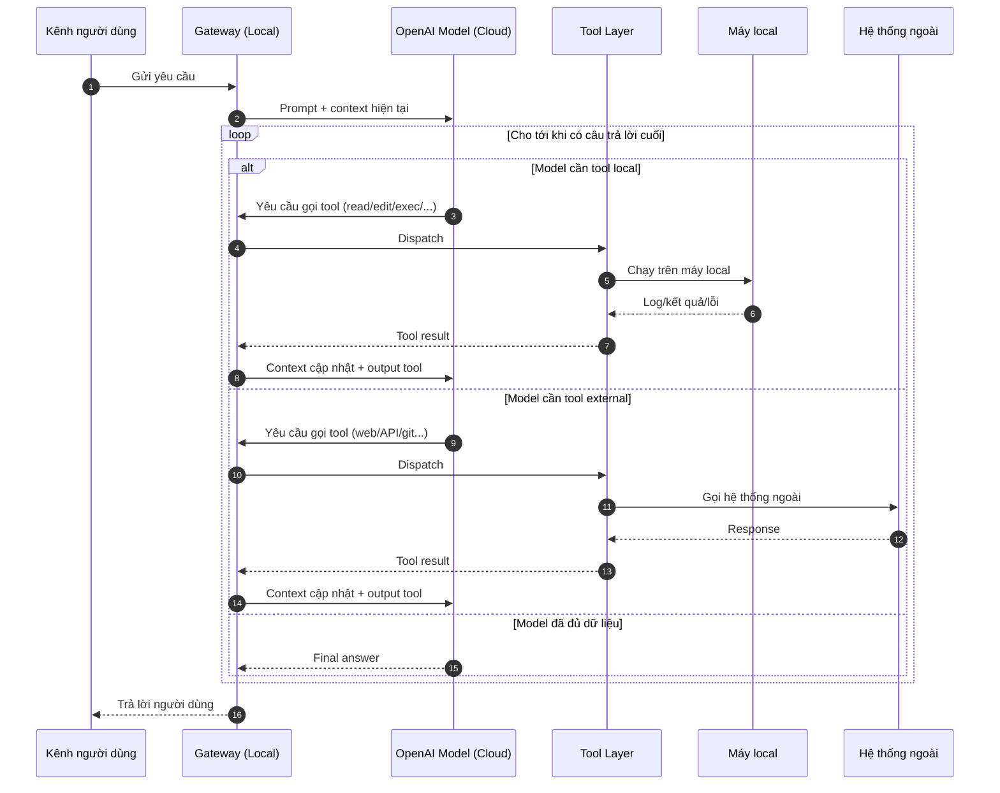
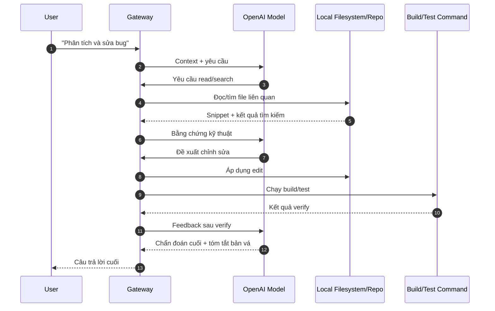

# Mô hình vận hành AI Agent (mô tả kỹ thuật)

## 1) Agent chạy ở đâu?

- **Gateway runtime (máy local)**
  - Giữ session, context, route message, quản lý tool.
  - Thực thi tool local như `read`, `edit`, `exec`, browser automation... trên chính máy.

- **LLM runtime (OpenAI cloud)**
  - Sinh kế hoạch, quyết định gọi tool, tổng hợp câu trả lời.
  - Không tự đọc/ghi file local nếu không đi qua tool call do Gateway cho phép.

- **Hệ thống ngoài**
  - GitHub, ngrok, API bên thứ ba, web service.

=> Tóm lại: **não suy luận ở cloud**, còn **tay chân thao tác hệ thống** ở local.

---

## 2) Vòng lặp xử lý: agent ↔ model ↔ tool

Luồng không phải 1 phát ra đáp án, mà là vòng lặp nhiều lượt:

1. User gửi yêu cầu vào Gateway.
2. Gateway gửi prompt + context hiện tại cho model OpenAI.
3. Model quyết định:
   - trả lời luôn, hoặc
   - yêu cầu gọi 1 hay nhiều tool.
4. Gateway chạy tool tương ứng (local/external), lấy output.
5. Output tool được đưa ngược vào context.
6. Gateway gửi context mới cho model.
7. Lặp lại bước 3–6 cho tới khi model trả final answer.

Điều kiện dừng:
- Có final answer,
- Timeout/guardrail,
- User ngắt.

---

## 3) Sequence diagram tổng quát

---

## 4) Xử lý context lớn (ví dụ 500 file local)

Hệ thống không nạp 500 file cùng lúc. Cách làm là truy hồi tăng dần:

### 4.1 Discovery (khoanh vùng)
- Liệt kê file ứng viên theo đường dẫn, extension, tên file, điểm vào hệ thống.
- Ưu tiên cụm liên quan trực tiếp lỗi/yêu cầu.

### 4.2 Targeted read (đọc có chọn lọc)
- Đọc trước file tín hiệu cao: entrypoint, service chính, log/error liên quan.
- Dùng search để thu hẹp: symbol, endpoint, lỗi cụ thể.

### 4.3 Iterative expansion (mở rộng theo vòng)
- Nếu chưa đủ bằng chứng, mở rộng sang file import/callee/model lân cận.
- Lặp theo chiều rộng/chiều sâu đến khi đủ độ tin cậy.

### 4.4 Context budgeting (quản lý cửa sổ ngữ cảnh)
- Mỗi lượt chỉ gửi một phần snippet quan trọng vào model.
- Snippet cũ ít giá trị sẽ tóm tắt hoặc loại bỏ.
- Giữ lại các “fact” quan trọng ở dạng ngắn gọn.

### 4.5 Synthesize + verify
- Model đề xuất sửa/chạy lệnh.
- Tool áp dụng sửa đổi, chạy build/test.
- Kết quả verify quay lại vòng lặp để ra quyết định tiếp.

=> Kết luận: **500 file được xử lý theo chiến lược truy hồi nhiều lượt**, không đổ toàn bộ vào model một lần.

---

## 5) Hệ quả thực tế

- Chất lượng trả lời phụ thuộc mạnh vào chất lượng truy hồi + log tool.
- Task phức tạp cần nhiều vòng model/tool là bình thường.
- Tool output rõ ràng (stack trace, grep, test log) giúp model quyết định đúng hơn.

---

## 6) Sequence cho case sửa bug code

---

## Hướng dẫn dùng skills (thực hành từng bước)

Đọc tại: `ai-sequence-diagram/OPENCLAW_SKILLS_FOR_DEVS.md`

Mục quan trọng:
- "Cách sử dụng skill — làm theo từng bước"
- "Template prompt copy dùng ngay"
- "Checklist verify output"
