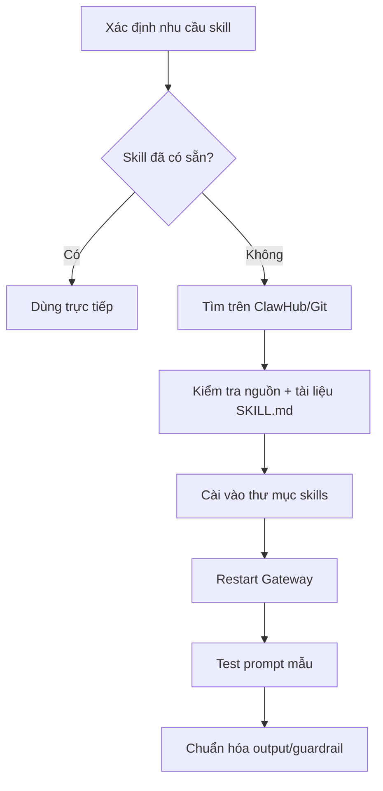
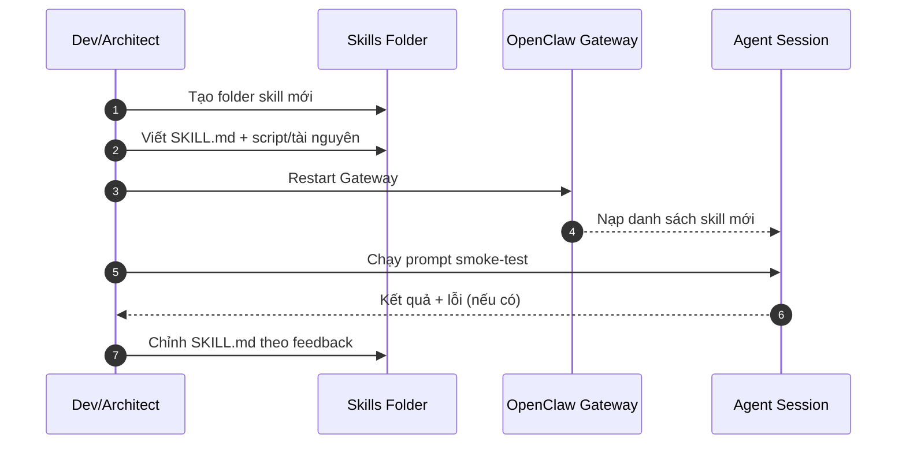

# OpenClaw Skills cho Dev/Architect — Bản chi tiết triển khai thực chiến

Tài liệu này tách rõ:
1. **Skill có sẵn (built-in)**: giới thiệu chi tiết cách dùng.
2. **Skill chưa có sẵn**: hướng dẫn cài đặt từng bước.
3. Có **hình minh họa (Mermaid)** cho luồng cài đặt và workflow vận hành.

---

## 1) Mục tiêu khi chọn skill cho dev architecture

Ưu tiên skill giúp tăng 4 nhóm năng suất:
- **A. Coding throughput** (fix/refactor/build nhanh hơn)
- **B. Decision quality** (đọc log, tóm tắt, theo dõi context)
- **C. Delivery flow** (issue, PR, docs, release)
- **D. Ops reliability** (audit host, debug API/runtime)

---

## 2) Skill có sẵn (built-in) — giới thiệu chi tiết

> Danh sách dưới đây dựa trên bộ skill hiện có trong OpenClaw runtime (máy hiện tại).

## 2.1 Nhóm bắt buộc cho Dev/Architect

### 2.1.1 `coding-agent`
**Mục đích**
- Task coding nhiều file, bug khó, refactor lớn, migration codebase.

**Khi nên dùng**
- Feature mới > 3 file.
- Root-cause chưa rõ, cần đọc code + chạy build/test lặp.

**Khi không nên dùng**
- Sửa 1–2 dòng đơn giản (sửa trực tiếp nhanh hơn).

**Output chuẩn nên yêu cầu**
- Root cause
- Danh sách file đổi
- Kết quả build/test
- Risk còn lại

---

### 2.1.2 `session-logs`
**Mục đích**
- Truy lại lịch sử hành động agent theo phiên.

**Giá trị cho architect**
- Audit quyết định kỹ thuật.
- Soi chuỗi lỗi “đã fix rồi lại tái phát”.

---

### 2.1.3 `summarize`
**Mục đích**
- Tóm tắt output dài (test logs, CI logs, changelog, PR lớn).

**Giá trị**
- Giảm thời gian đọc output rác, tập trung vào anomaly/risk.

---

### 2.1.4 `github` + `gh-issues`
**Mục đích**
- Kết nối workflow kỹ thuật với issue/PR.

**Use case**
- Map bug -> issue -> commit -> PR summary.
- Triage issue theo mức độ ảnh hưởng architecture.

---

### 2.1.5 `model-usage`
**Mục đích**
- Theo dõi usage/cost/model footprint.

**Giá trị**
- Architect có số liệu để tối ưu policy dùng model theo loại task.

---

## 2.2 Nhóm hỗ trợ delivery & docs

### `notion`, `obsidian`, `trello`
- Quản lý kiến trúc, ADR, roadmap, checklist release.

### `nano-pdf`, `video-frames`
- Bóc tách tài liệu kỹ thuật/PDF, trích frame demo bug từ video.

### `openai-whisper` / `openai-whisper-api`
- Chuyển meeting audio thành action items kỹ thuật.

---

## 2.3 Nhóm vận hành/hạ tầng

### `healthcheck`
- Audit bảo mật/ổn định host chạy OpenClaw.

### `tmux`, `xurl`
- Chạy job dài, debug API, repeatable terminal workflow.

---

## 3) Ma trận “skill nào cho việc gì”

| Loại việc | Skill chính | Skill phụ |
|---|---|---|
| Fix bug nhiều file | coding-agent | session-logs, summarize |
| Refactor module | coding-agent | github |
| Triage issue/PR | gh-issues | github, summarize |
| Review log production | summarize | session-logs |
| Viết ADR / docs kiến trúc | notion / obsidian | summarize |
| Audit host OpenClaw | healthcheck | tmux, xurl |

---

## 4) Skill chưa có sẵn — cách cài đặt chi tiết

## 4.1 Luồng cài đặt tổng quát

---

## 4.2 Cài từ ClawHub (khuyến nghị)

### Bước 1: Tìm skill phù hợp
- Vào ClawHub, tìm theo domain (devops, db migration, cloud, observability...).

### Bước 2: Đọc metadata trước khi cài
- Scope, dependencies, quyền tool cần dùng.
- Phiên bản OpenClaw tương thích.

### Bước 3: Install
- Cài theo hướng dẫn của skill (UI/CLI tuỳ skill).

### Bước 4: Verify
- Kiểm tra skill xuất hiện trong danh sách skills.
- Chạy prompt smoke-test ngắn.

### Bước 5: Hardening
- Giới hạn tool allowlist nếu skill nhạy cảm.
- Chốt policy output.

---

## 4.3 Cài thủ công (manual install)

> Dùng khi skill nội bộ hoặc chưa publish trên marketplace.

### Bước 1: Tạo thư mục skill
- Đặt tại thư mục skills của OpenClaw.

### Bước 2: Tạo `SKILL.md`
Nội dung tối thiểu:
- **Dùng khi nào / Không dùng khi nào**
- Input/Output kỳ vọng
- Checklist thao tác
- Ràng buộc an toàn

### Bước 3: Thêm file phụ trợ (nếu có)
- script, template, assets.

### Bước 4: Restart Gateway
- để nạp skill mới.

### Bước 5: Test 3 ca
- Happy path
- Edge case
- Failure path

---

## 4.4 “Hình” minh họa từng bước cài manual

---

## 5) Bộ skill stack khuyến nghị theo cấp độ

## 5.1 Cá nhân dev (MVP)
- `coding-agent`
- `session-logs`
- `summarize`
- `github`

## 5.2 Team sản phẩm
- Bộ MVP + `gh-issues`, `notion`/`trello`, `model-usage`

## 5.3 Team platform/architecture
- Bộ Team + `healthcheck`, `tmux`, `xurl`, `nano-pdf`, `openai-whisper`

---

## 6) Tiêu chí “Done” khi triển khai skill mới

- [ ] Có `SKILL.md` rõ scope/non-scope
- [ ] Có prompt mẫu cho 3 use case thực
- [ ] Có output format chuẩn
- [ ] Có guardrail an toàn
- [ ] Có smoke-test pass
- [ ] Có owner bảo trì skill

---

## 7) Mẫu prompt cho architect (copy dùng ngay)

### 7.1 Phân tích lỗi hệ thống
> Dùng coding-agent + session-logs. Tìm root cause lỗi X, xác nhận bằng build/test, trả patch tối thiểu và risk mở.

### 7.2 Triage backlog kỹ thuật
> Dùng gh-issues + summarize. Nhóm issue theo impact kiến trúc, đề xuất thứ tự xử lý theo effort/risk.

### 7.3 Audit host chạy OpenClaw
> Dùng healthcheck. Xuất checklist hardening theo P0/P1/P2 và hành động khắc phục.

---

## 8) Kết luận

Để tối ưu năng suất dev/architect, đừng chỉ “có skill là dùng”: 
- phải **chọn đúng skill theo loại việc**,
- **có verify loop**, 
- và **chuẩn hóa output**.

Skill là lớp khuếch đại năng suất, nhưng chỉ hiệu quả khi triển khai có kỷ luật.

---

## 9) Cách sử dụng skill — làm theo từng bước (copy dùng ngay)

> Mục này là playbook thực hành. Đọc xong có thể dùng ngay.

### Bước 1: Chốt đúng mục tiêu
Viết 1 câu rõ ràng theo mẫu:
- **Đầu vào**: repo/module/lỗi cụ thể
- **Đầu ra**: kết quả mong muốn
- **Ràng buộc**: không phá API, phải build pass, phải có commit...

Ví dụ:
> "Sửa lỗi sync reorder trong repo X, không đổi API public, build pass, commit + push main."

### Bước 2: Chọn skill theo loại việc
- Code nhiều file: `coding-agent`
- Soi lịch sử phiên/lỗi cũ: `session-logs`
- Tóm tắt log dài/PR dài: `summarize`
- Làm việc issue/PR: `github`, `gh-issues`
- Audit host: `healthcheck`

### Bước 3: Gửi prompt theo template chuẩn

#### Template A — Fix bug
> Dùng `coding-agent`.
> - Repo: <path/repo>
> - Bug: <mô tả lỗi + cách tái hiện>
> - Điều kiện xong: build pass, test pass, list file đổi, root cause.

#### Template B — Refactor
> Dùng `coding-agent`.
> Refactor module <X> theo SOLID, giữ backward compatibility, thêm test regression, báo risk.

#### Template C — Triage issue
> Dùng `gh-issues` + `summarize`.
> Gom issue theo mức độ ảnh hưởng P0/P1/P2, đề xuất thứ tự xử lý theo effort/risk.

### Bước 4: Ép verify bắt buộc
Luôn yêu cầu agent trả đủ:
- [ ] Root cause
- [ ] File changed
- [ ] Build/Test result
- [ ] Risk còn lại
- [ ] Commit hash / PR link (nếu có)

### Bước 5: Chốt output format
Yêu cầu output theo format cố định để dễ review:
1. Root cause
2. Patch summary
3. Verification
4. Next actions

---

## 10) Ví dụ end-to-end (thực tế)

### Case: Bug kéo-thả không lưu thứ tự
Prompt nên gửi:
> "Dùng coding-agent, sửa lỗi drag-drop reorder không persist trong repo todolist.
> Kiểm tra event TODO_REORDERED, sortOrder, build pass. Commit và push lên main."

Kết quả kỳ vọng:
- Agent đọc file liên quan (`todo.effects.ts`, `event-sourcing.service.ts`, model)
- Sửa luồng action/effect/event apply
- Chạy build
- Trả commit hash + tóm tắt file đổi

---

## 11) Khi nào cần cài skill mới (chưa có sẵn)

Cài skill mới khi thỏa 2 điều kiện:
1. Công việc lặp đi lặp lại >= 3 lần/tuần
2. Prompt hiện tại dài và dễ quên bước

Quy trình nhanh:
- Tạo skill -> viết `SKILL.md` -> test 3 ca (happy/edge/fail) -> chốt owner duy trì.

---

## 12) Checklist “đọc xong phải làm được”

- [ ] Biết chọn skill theo loại task
- [ ] Biết viết prompt theo template
- [ ] Biết ép verify output
- [ ] Biết khi nào nên cài skill mới
- [ ] Biết cách đóng gói workflow thành skill nội bộ

---

## Quickstart: Dùng ngay trong 5 phút

### 1) Sửa bug code (chuẩn nhất)
**Gõ:**
> Dùng coding-agent, sửa lỗi `<mô tả lỗi>` trong repo `<đường dẫn>`. Build pass, liệt kê file đổi, commit + push.

**Kết quả mong đợi:**
- root cause
- patch summary
- build/test result
- commit hash

### 2) Refactor an toàn
**Gõ:**
> Dùng coding-agent, refactor module `<tên module>` theo SOLID, không đổi API public, thêm test regression.

**Kết quả mong đợi:**
- danh sách điểm refactor
- compatibility check
- test pass

### 3) Tóm tắt log dài
**Gõ:**
> Dùng summarize, tóm tắt log này theo format: nguyên nhân chính / ảnh hưởng / action đề xuất.

### 4) Triage issue GitHub
**Gõ:**
> Dùng gh-issues + github, nhóm issue theo P0/P1/P2, đề xuất thứ tự xử lý theo risk/effort.

### 5) Audit máy chạy OpenClaw
**Gõ:**
> Dùng healthcheck, audit host và trả checklist hardening theo P0/P1/P2.

---

## Mẫu output bắt buộc (copy vào prompt)

> Trả kết quả theo đúng 4 mục:
> 1. Root cause
> 2. Patch summary
> 3. Verification (build/test/log)
> 4. Next actions

---

## Dấu hiệu dùng sai skill

- Bug code phức tạp nhưng chỉ hỏi one-shot không dùng coding-agent.
- Không yêu cầu verify nên output “đúng lý thuyết, sai thực tế”.
- Không chốt format đầu ra nên đọc xong không biết làm gì tiếp.
