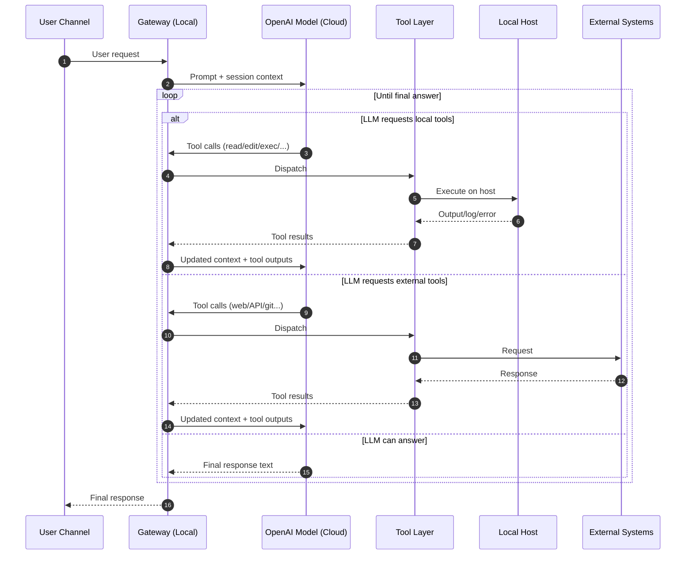
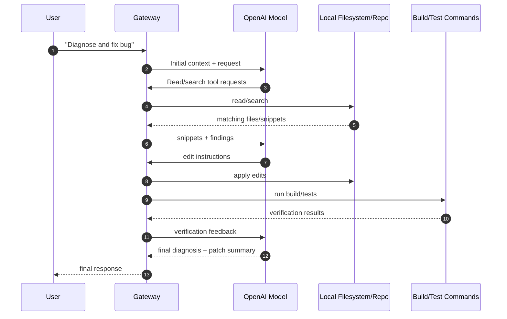

# AI Agent Execution Model (Technical Description)

## 1) Runtime placement

- **Gateway runtime (local machine)**
  - Maintains session state, tool registry, routing, and channel integrations.
  - Executes local tools (`read`, `edit`, `exec`, browser automation, etc.) on the host.

- **LLM runtime (OpenAI cloud)**
  - Produces reasoning, plans, tool-call decisions, and final responses.
  - Does not directly access local files or processes without tool invocation through Gateway.

- **External systems**
  - GitHub, ngrok, third-party APIs, web services.

---

## 2) Control loop: agent ↔ model ↔ tools

The agent workflow is iterative, not single-shot.

1. User message arrives at Gateway.
2. Gateway sends prompt + current session context to LLM.
3. LLM decides either:
   - return final answer, or
   - request one/more tool calls.
4. Gateway executes requested tools (local/external), captures outputs.
5. Tool outputs are appended to session context.
6. Gateway sends updated context back to LLM.
7. Steps 3–6 repeat until LLM emits a final user-facing response.

This loop continues until one of these conditions is met:
- final response produced,
- timeout/guardrail stop,
- user interruption.

---

## 3) Sequence diagram (tool-augmented loop)

---

## 4) How large local context is handled (example: 500 files)

Large workspaces are handled by **progressive retrieval**, not full ingestion.

### 4.1 Discovery phase
- Enumerate candidate files (by path, extension, naming, recency, known entry points).
- Identify likely relevance clusters (API layer, services, UI, config, tests).

### 4.2 Targeted read phase
- Read only high-signal files first (entry points, wiring, error locations, stack traces).
- Use search-driven narrowing (symbol names, endpoint strings, error tokens).

### 4.3 Iterative context expansion
- If evidence is insufficient, expand to adjacent files (imports/callees/models).
- Continue breadth/depth expansion until confidence threshold is reached.

### 4.4 Context window budgeting
- Only a bounded subset of snippets is sent to LLM each iteration.
- Older/less relevant snippets are summarized or dropped.
- High-value facts are retained as compact structured notes.

### 4.5 Synthesis + action
- LLM proposes edits/commands.
- Tools apply changes and run verification (build/tests/run).
- Results are fed back into loop for next decision.

In short: **500 files are not sent at once**; the system performs staged retrieval + iterative refinement.

---

## 5) Practical implications

- Accuracy depends on retrieval quality and iteration depth.
- Tool output quality (logs, stack traces, grep results) strongly impacts final answer quality.
- For complex tasks, multiple tool/LLM rounds are expected and normal.

---

## 6) Sequence for code-fix scenario

