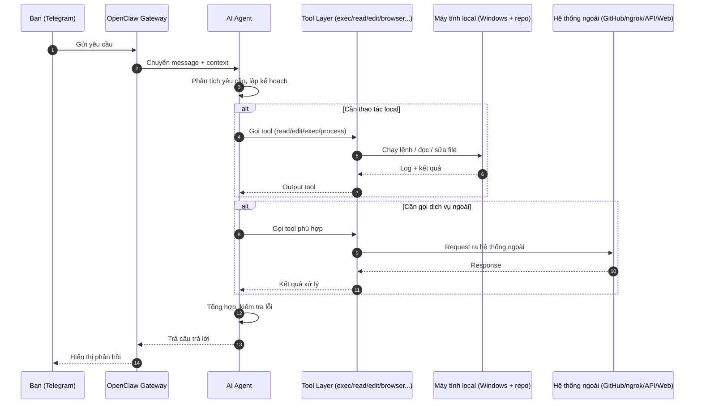

# AI Interaction Sequence Diagram

```mermaid
sequenceDiagram
    autonumber
    participant U as Bạn (Telegram)
    participant G as OpenClaw Gateway
    participant A as AI Agent
    participant T as Tool Layer (exec/read/edit/browser...)
    participant M as Máy tính local (Windows + repo)
    participant X as Hệ thống ngoài (GitHub/ngrok/API/Web)

    U->>G: Gửi yêu cầu
    G->>A: Chuyển message + context
    A->>A: Phân tích yêu cầu, lập kế hoạch

    alt Cần thao tác local
        A->>T: Gọi tool (read/edit/exec/process)
        T->>M: Chạy lệnh / đọc / sửa file
        M-->>T: Log + kết quả
        T-->>A: Output tool
    end

    alt Cần gọi dịch vụ ngoài
        A->>T: Gọi tool phù hợp
        T->>X: Request ra hệ thống ngoài
        X-->>T: Response
        T-->>A: Kết quả xử lý
    end

    A->>A: Tổng hợp, kiểm tra lỗi
    A-->>G: Trả câu trả lời
    G-->>U: Hiển thị phản hồi
```
