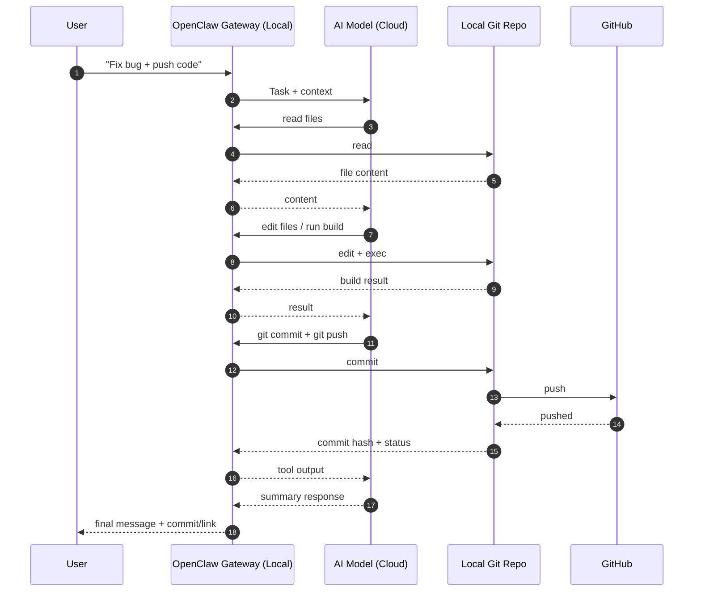

# AI Agent chạy ở đâu? (Giải thích chi tiết)

## TL;DR
- **AI Agent (thằng đang chat với mày)**: chạy trong phiên OpenClaw, không chạy trực tiếp như 1 process local độc lập kiểu app desktop.
- **Model AI (OpenAI)**: chạy trên cloud của OpenAI (suy luận ở server model).
- **Tool local (read/edit/exec...)**: chạy trên **máy của mày** qua OpenClaw Gateway.

Nói ngắn: **não AI ở cloud**, còn **tay chân thao tác file/lệnh** là ở local máy mày.

---

## Thành phần và vị trí

1. **Bạn (Telegram)**
   - Gửi yêu cầu từ Telegram.

2. **OpenClaw Gateway (local)**
   - Chạy trên máy mày.
   - Nhận message từ Telegram, giữ context session, cung cấp tool (exec/read/edit/browser...).

3. **AI Model Runtime (OpenAI cloud)**
   - Nơi model tạo reasoning + câu trả lời.
   - Không tự có quyền đụng file local nếu không thông qua tool call từ Gateway.

4. **Tool Layer (bridge)**
   - Lớp trung gian để model gọi công cụ.
   - Ví dụ `exec`, `read`, `edit` chạy trên local host.

5. **Máy local của mày**
   - Nơi thật sự có repo, file, terminal, process.

6. **Hệ thống ngoài**
   - GitHub, ngrok, API bên thứ ba...

---

## Diagram 1 — Luồng tổng quát (cloud + local)

```mermaid
sequenceDiagram
    autonumber
    participant U as User (Telegram)
    participant GW as OpenClaw Gateway (Local machine)
    participant AI as AI Model (OpenAI Cloud)
    participant TL as Tool Layer (Gateway)
    participant L as Local OS/Repo/Terminal
    participant EXT as External Systems (GitHub/ngrok/APIs)

    U->>GW: Send request message
    GW->>AI: Forward prompt + session context
    AI->>AI: Reasoning / planning

    alt Need local actions
        AI->>GW: Tool call request (read/edit/exec/...)
        GW->>TL: Dispatch tool call
        TL->>L: Execute on local machine
        L-->>TL: Output/log/error
        TL-->>GW: Tool result
        GW-->>AI: Return tool result
    end

    alt Need external actions
        AI->>GW: Tool call (web_fetch/git push/...)
        GW->>TL: Execute tool
        TL->>EXT: Request to external service
        EXT-->>TL: Response
        TL-->>GW: Tool result
        GW-->>AI: Return tool result
    end

    AI-->>GW: Final answer text
    GW-->>U: Deliver reply
```

---

## Diagram 2 — Case code fix + push GitHub

---

## Trả lời câu hỏi của mày (rõ luôn)

- "AI agent ở local hay OpenAI?"
  - **Model AI** ở OpenAI cloud.
  - **Gateway + tools** ở local máy mày.
  - Vì vậy tao có thể sửa file local, chạy lệnh local, rồi push GitHub thay mày.

- "AI có tự ý đụng máy được không?"
  - Không. Chỉ khi đi qua tool call do Gateway cho phép.

